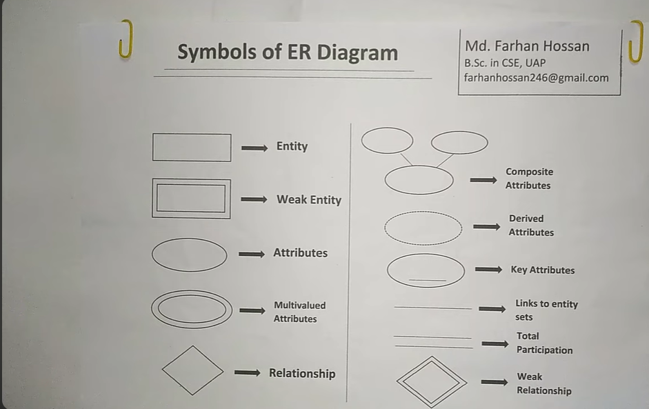
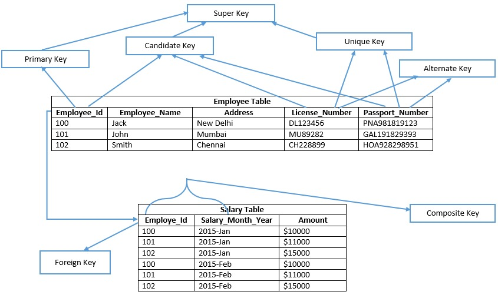
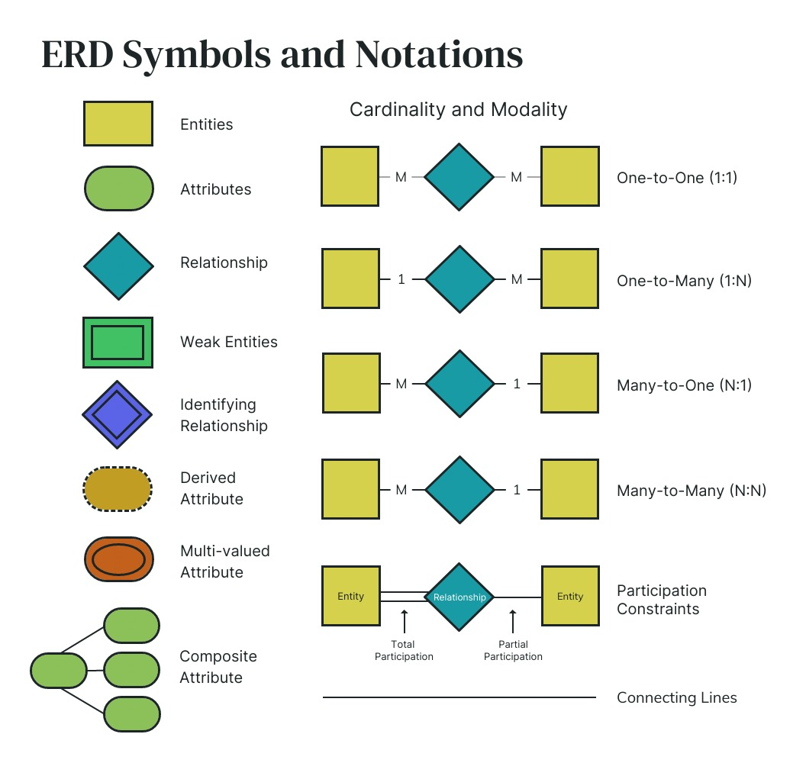
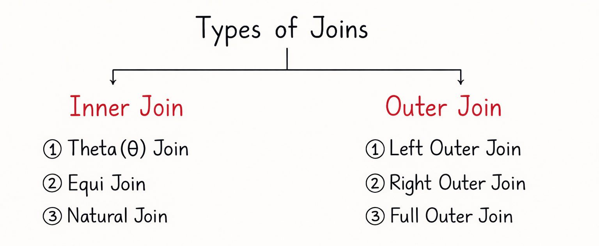

# 📚 Complete Database Management System (DBMS) Notes

> **Comprehensive Study Guide for DBMS**  
> Last Updated: December 13, 2025

---

## 📑 Table of Contents

- [1. Database Fundamentals](#1-database-fundamentals)
- [2. File System vs DBMS](#2-file-system-vs-dbms)
- [3. Components of DBMS](#3-components-of-dbms)
- [4. Database Architecture](#4-database-architecture)
- [5. OLAP vs OLTP](#5-olap-vs-oltp)
- [6. Data Abstraction](#6-data-abstraction)
- [7. Data Independence](#7-data-independence)
- [8. Database Schema](#8-database-schema)
- [9. Constraints](#9-constraints)
- [10. Types of Keys](#10-types-of-keys)
- [11. ER Diagrams](#11-er-diagrams)
- [12. Types of Attributes](#12-types-of-attributes)
- [12. Design Technique Model](#12-design-technique-model)
- [13. Normalization](#13-normalization)
- [14. Relational-algebra](#14-relational-algebra)
- [15. SQL Joins](#15-sql-joins)
- [16. Transactions](#15-transactions)
- [17. DBMS Terminology Reference](#16-dbms-terminology-reference)

---

## 1. Database Fundamentals

### 1.1 Definition
A **database** is an organized collection of data that is stored and accessed electronically.

### 1.2 Types of Data in Databases

#### 1.2.1 Structured Data
- Organized in a predefined format, typically tabular
- Example: Table with columns `Name`, `Phone`, `Address`, `P.Name`

#### 1.2.2 Unstructured Data (Document-based)
- Not confined to a rigid schema; often stored as documents
- Example:
  ```json
  {
    "Name": "A",
    "Phone": "01700000000",
    "Address": "XYZ",
    "P-Name": "ABC"
  }
  ```

### 1.3 Types of Databases (Based on Structure)
1. **Document-Based**: Stores data in document formats (JSON/XML)
2. **Key-Value Based**: Simple key-value pair structure for fast retrieval
3. **Column-Based**: Optimized for queries over large datasets
4. **Graph-Based**: Represents data as nodes and edges for relationships

---

## 2. File System vs DBMS

| Feature | File System | DBMS |
|---------|-------------|------|
| **Data Storage** | Individual files (`.txt`, `.csv`) | Structured tables with defined schemas |
| **Data Redundancy** | High – data duplication across files | Low – uses normalization |
| **Data Consistency** | Poor – updates may not reflect everywhere | High – ensures consistency via ACID |
| **Data Security** | Limited – OS-level permissions only | Strong – authentication, roles, access control |
| **Data Integrity** | Not enforced | Enforced via constraints |
| **Concurrent Access** | Limited or no support | Supports with locking and transactions |
| **Query Capabilities** | Very limited – manual parsing | Powerful – SQL for complex queries |
| **Backup & Recovery** | Manual or OS-dependent | Built-in automated mechanisms |
| **Scalability** | Poor for large/complex data | Highly scalable |
| **Data Abstraction** | None – direct file access | Provides abstraction layers |
| **Example** | Student records in `.txt` files | MySQL/PostgreSQL university database |

### 2.1 When to Use What?
- **File System**: Simple, small-scale data (logs, config files)
- **DBMS**: Applications requiring integrity, security, concurrent access

> 💡 **Key Advantage**: DBMS provides **ACID** properties (Atomicity, Consistency, Isolation, Durability)

---

## 3. Components of DBMS



### 3.1 Hardware
- Physical devices (servers, storage units)
- Provides computing resources for data management

### 3.2 Software
- DBMS software (MySQL, Oracle, PostgreSQL)
- Manages data storage, retrieval, updates, and security
- Includes database engine, query processor, and tools

### 3.3 Data
- **Most important component**
- Includes:
  - **User data**: Actual records (student info, products)
  - **Metadata**: Data about data (schemas, constraints)

### 3.4 Procedures
- Rules and instructions for using DBMS
- Examples: Backup protocols, authentication steps, design guidelines

### 3.5 Database Access Language
- **SQL (Structured Query Language)**
- Allows users to:
  - **DDL**: Define data (`CREATE`, `ALTER`)
  - **DML**: Manipulate data (`SELECT`, `INSERT`, `UPDATE`)
  - **DCL**: Control access (`GRANT`, `REVOKE`)

### 3.6 Users
- **Database Administrators (DBAs)**: Manage and maintain system
- **Application Programmers**: Write code accessing DB
- **End Users**: Query/use data via applications
- **System Analysts**: Design database requirements

### 3.7 Query Processor
- Translates high-level queries into low-level instructions
- Components:
  - **DDL Interpreter**: Handles schema definitions
  - **DML Compiler**: Converts DML to executable code
  - **Query Optimizer**: Finds efficient execution paths

### 3.8 Storage Manager (Database Engine)
- Interface between stored data and queries
- Manages disk space, indexes, data retrieval
- Sub-components:
  - **File Manager**: Disk space allocation
  - **Buffer Manager**: Data caching in memory

### 3.9 Transaction Manager
- Ensures **ACID properties**
- Uses log files and concurrency control (locking)

---

## 4. Database Architecture

### 4.1 2-Tier Architecture (Client-Server)

#### Structure:
```
[Client (Front-end)] ⇄ [Database Server (Back-end)]
```

#### Characteristics:
- ✅ Simple to develop and deploy
- ✅ Suitable for small-scale applications
- ❌ Tight coupling – schema changes require client updates
- ❌ Security risk – direct DB access
- ❌ Poor scalability

#### Example:
Desktop app directly querying MySQL server

---

### 4.2 3-Tier Architecture (Multi-tier / Web-based)

#### Structure:
```
[Client (Presentation Layer)]
        ↓
[Application Server (Business Logic Layer)]
        ↓
[Database Server (Data Layer)]
```

**How It Works:**
1. **Client**: User interface (browser, mobile app)
2. **Application Server**: Processes business logic, acts as middleman
3. **Database Server**: Stores and manages data

**Characteristics:**
- ✅ Loose coupling – layers are independent
- ✅ Enhanced security – DB hidden from clients
- ✅ Better scalability & maintainability
- ✅ Supports many concurrent users
- ❌ More complex to design

**Example**: Gmail (Browser → Google servers → Database)

### Comparison

| Feature | 2-Tier | 3-Tier |
|---------|--------|--------|
| **Layers** | Client + DB Server | Client + App Server + DB |
| **Business Logic** | On client | On application server |
| **Scalability** | Low | High |
| **Security** | Lower | Higher |
| **Maintenance** | Harder | Easier |
| **Use Case** | Small desktop apps | Web/mobile apps, enterprise |

---

## 5. OLAP vs OLTP

| Feature | OLTP (Online Transaction Processing) | OLAP (Online Analytical Processing) |
|---------|--------------------------------------|-------------------------------------|
| **Purpose** | Handle day-to-day transactions | Support complex analysis & decision-making |
| **Primary Users** | Clerks, customers, staff | Data analysts, managers, executives |
| **Database Design** | Normalized (3NF) | Denormalized (star/snowflake schema) |
| **Operations** | Write-heavy: `INSERT`, `UPDATE`, `DELETE` | Read-heavy: complex `SELECT` with aggregations |
| **Query Complexity** | Simple, standardized, fast | Complex, ad-hoc, involves `JOIN`s |
| **Response Time** | Milliseconds (real-time) | Seconds to hours |
| **Data Volume** | Many small transactions | Large historical datasets |
| **Data Source** | Operational data (current) | Data warehouse (aggregated, historical) |
| **Concurrency** | High | Low to moderate |
| **ACID Compliance** | ✅ Strictly enforced | ❌ Not always required |
| **Examples** | ATM, e-commerce orders, bookings | Sales trends, quarterly reports, BI dashboards |

### 5.1 System Flow
```
OLTP Systems (POS, Banking)
        ↓
[ETL: Extract, Transform, Load]
        ↓
Data Warehouse (Denormalized)
        ↓
OLAP System (Power BI, Tableau)
```

> 💡 **Remember**: OLTP = **Operational**, OLAP = **Analytical**

---

## 6. Data Abstraction

**Data abstraction** hides unnecessary storage details from users, presenting only relevant information.

### 6.1 Three Levels of Data Abstraction (ANSI/SPARC Architecture)

| Level | Also Called | Description | Example |
|-------|-------------|-------------|---------|
| **1. Physical Level** | Internal Level | How data is stored on disk (files, indexes, hashing) | Data stored as B+ trees |
| **2. Logical Level** | Conceptual Level | What data is stored and relationships | Tables: `Student(id, name, dept)` |
| **3. View Level** | External Level | User-specific views of database | Student sees only their grades |

### Purpose
- ✅ Simplifies user interaction
- ✅ Improves security
- ✅ Enhances data independence
- ✅ Supports multiple user perspectives

### Quick Summary
- **Physical Level** → *How?* (Storage details)
- **Logical Level** → *What?* (Tables, relationships)
- **View Level** → *Who sees what?* (Custom interfaces)

---

## 7. Data Independence

**Data independence** is the ability to modify schema at one level without affecting the next higher level.

### 7.1 Types of Data Independence

#### 7.1.1 Physical Data Independence
- **Definition**: Change physical storage without affecting logical schema
- **Changes**:
  - New storage device (SSD vs HDD)
  - File organization (heap to B+ tree)
  - Adding indexes or hashing
  - Data compression/encryption
- ✅ **Easy to achieve**

**Example**: Adding index on `Student.roll_no` – applications still use `SELECT * FROM Student`

#### 7.1.2 Logical Data Independence
- **Definition**: Change logical schema without affecting external views
- **Changes**:
  - Adding/removing columns
  - Splitting/merging tables
  - Adding relationships
- ⚠️ **Harder to achieve**
- Mitigated using **views**

**Example**: Splitting `Employee` table – views hide changes from apps

### Comparison

| Feature | Physical | Logical |
|---------|----------|---------|
| **Level Changed** | Internal (Physical) | Conceptual (Logical) |
| **Affects Higher Level?** | ❌ No | ❌ No (ideally) |
| **Ease** | ✅ Easy | ⚠️ Difficult |
| **Handled By** | Storage Manager | Query Processor + Views |
| **Example** | Adding index | Adding column |

> 🎯 **Remember**: Physical → *Storage changes*, Logical → *Structure changes*

---

## 8. Database Schema

### 8.1 Definition
A **database schema** is the **logical structure or blueprint** of a database.

Defines:
- Tables and their names
- Columns (attributes) and data types
- Constraints (primary keys, foreign keys, `NOT NULL`, `UNIQUE`)
- Relationships between tables
- Views, indexes, other objects

> 🔑 **Key Point**: Schema describes structure, **not actual data**

### 8.2 Types of Schemas

| Type | Description | Example |
|------|-------------|---------|
| **Physical Schema** | How data is stored on disk | B+ tree index on `Student.id` |
| **Logical Schema** | Overall structure: tables, columns, relationships | `Student(id, name, dept_id)` |
| **View Schema** | User-specific views | View showing only `name` and `grade` |

### 8.3 Example (SQL DDL)

```sql
CREATE TABLE Student (
    id INT PRIMARY KEY,
    name VARCHAR(50) NOT NULL,
    email VARCHAR(100) UNIQUE,
    dept_id INT,
    FOREIGN KEY (dept_id) REFERENCES Department(id)
);

CREATE TABLE Department (
    id INT PRIMARY KEY,
    name VARCHAR(50)
);
```

### 8.4 Schema vs Instance

| Schema | Instance |
|--------|----------|
| **Structure** (static, changes rarely) | **Actual data** (dynamic, changes frequently) |
| Defined once (via DDL) | Changes with `INSERT`/`UPDATE`/`DELETE` |
| Like a **class** in OOP | Like an **object** |

> ✅ **Analogy**: Schema = Architect's blueprint, Instance = Furnished house

---

## 9. Constraints

A **constraint** is a rule applied to data columns to enforce **data integrity**, **accuracy**, and **validity**.

### 9.1 Types of Constraints

#### 9.1.1 NOT NULL
- Column cannot have NULL values

```sql
id INT NOT NULL,
name VARCHAR(50) NOT NULL
```

#### 9.1.2 UNIQUE
- All values must be distinct
- Multiple `NULL`s allowed (in most DBMS)

```sql
email VARCHAR(100) UNIQUE
```

#### 9.1.3 PRIMARY KEY
- Uniquely identifies each row
- Combines **NOT NULL + UNIQUE**
- Only **one** per table

```sql
id INT PRIMARY KEY
-- or composite:
PRIMARY KEY (student_id, course_id)
```

#### 9.1.4 FOREIGN KEY
- Creates relationship between tables
- References PRIMARY KEY of another table
- Ensures **referential integrity**

```sql
dept_id INT,
FOREIGN KEY (dept_id) REFERENCES Department(id)
```

#### 9.1.5 CHECK
- Enforces custom conditions

```sql
age INT CHECK (age >= 18),
grade CHAR(1) CHECK (grade IN ('A', 'B', 'C', 'D', 'F'))
```

#### 9.1.6 DEFAULT
- Assigns default value if none provided

```sql
status VARCHAR(20) DEFAULT 'active',
created_at DATE DEFAULT CURRENT_DATE
```

### 9.2 Summary Table

| Constraint | Purpose | Nulls Allowed? | Example |
|------------|---------|----------------|---------|
| `NOT NULL` | No missing values | ❌ No | User must provide email |
| `UNIQUE` | All values distinct | ✅ Yes (usually) | Employee ID, username |
| `PRIMARY KEY` | Unique row identifier | ❌ No | Student ID |
| `FOREIGN KEY` | Enforce relationship | ✅ Yes (unless NOT NULL) | `dept_id` → `Department.id` |
| `CHECK` | Custom validation | Depends | Age ≥ 18, salary > 0 |
| `DEFAULT` | Set value if none given | N/A | Default status = 'pending' |

> 💡 **Remember**: Primary Key = NOT NULL + UNIQUE

---

## 10. Types of Keys



A **key** is an attribute (or set) used to **uniquely identify a row** and **establish relationships**.

### 10.1 Super Key
- Set of one or more attributes that uniquely identify a row
- May contain **extra (unnecessary) attributes**
- **Example**: `{ID}`, `{ID, Email}` both are super keys

### 10.2 Candidate Key
- **Minimal super key** – no unnecessary attributes
- Uniquely identifies rows
- No subset can uniquely identify rows
- **Example**: `ID`, `Email`, `Passport_No` (each is unique and minimal)

### 10.3 Primary Key
- **Selected candidate key** for unique identification
- Must be **NOT NULL** and **UNIQUE**
- Only **one** per table

```sql
CREATE TABLE Student (
    ID INT PRIMARY KEY,
    Email VARCHAR(100) UNIQUE
);
```

### 10.4 Alternate Key
- **Candidate keys NOT chosen as primary key**
- **Example**: If `ID` is primary, then `Email` and `Passport_No` are alternate keys

### 10.5 Foreign Key
- References PRIMARY KEY of another table
- Enforces **referential integrity**
- Can be **NULL** (unless specified otherwise)

```sql
CREATE TABLE Enrollment (
    student_id INT,
    course_id INT,
    FOREIGN KEY (student_id) REFERENCES Student(ID)
);
```

### 10.6 Composite Key
- Primary key made of **two or more attributes**
- Used when no single column is unique

```sql
CREATE TABLE Enrollment (
    student_id INT,
    course_id INT,
    PRIMARY KEY (student_id, course_id)
);
```

### 10.7 Compound Key
- Composite key where **each part is a foreign key**
- **Example**: `OrderDetails(order_id, product_id)` – both are foreign keys

### 10.8 Surrogate Key
- **Artificial key** (not from application data)
- Usually auto-incremented integer or UUID
- **Why?** Natural keys may be unstable or too large

```sql
user_id SERIAL PRIMARY KEY  -- PostgreSQL
```

### 10.9 Summary Table


| Key Type | Purpose | Unique? | Null? | Example |
|----------|---------|---------|-------|---------|
| **Super Key** | Any set uniquely identifying rows | ✅ | ❌* | `{ID, Email}` |
| **Candidate Key** | Minimal super key | ✅ | ❌ | `ID`, `Email` |
| **Primary Key** | Chosen candidate key | ✅ | ❌ | `ID` |
| **Alternate Key** | Non-chosen candidate keys | ✅ | ❌ | `Email` (if ID is primary) |
| **Foreign Key** | References PK of another table | ❌ | ✅ | `student_id` → `Student(ID)` |
| **Composite Key** | PK with multiple columns | ✅ | ❌ | `(student_id, course_id)` |
| **Surrogate Key** | System-generated artificial key | ✅ | ❌ | Auto-increment `user_id` |

> 💡 **Remember**: Primary Key ⊆ Candidate Key ⊆ Super Key

---

## 11. ER Diagrams



An **ER Diagram (Entity-Relationship Diagram)** is a visual representation of database structure.

Shows:
- **Entities** (objects or concepts)
- **Attributes** (properties of entities)
- **Relationships** (how entities are connected)

### 11.1 Standard ER Diagram Symbols (Chen Notation)


| Symbol | Name | Description | Example |
|--------|------|-------------|---------|
| **Rectangle** | **Entity** | Real-world object | `Student`, `Course` |
| **Oval** | **Attribute** | Property of entity | `ID`, `Name`, `Email` |
| **Diamond** | **Relationship** | Association between entities | `enrolls in` |
| **Line** | **Connection** | Links entities to attributes/relationships | — |

### 11.2 Special Attribute Symbols

| Symbol | Meaning | Example |
|--------|---------|---------|
| **Underlined Oval** | **Primary Key Attribute** | `ID` (underlined) |
| **Double Oval** | **Multi-valued Attribute** | Multiple `Phone` numbers |
| **Dashed Oval** | **Derived Attribute** | `Age` (from `DateOfBirth`) |
| **Nested Ovals** | **Composite Attribute** | `Address` → `Street`, `City`, `ZIP` |

### 11.3 Relationship Cardinality

| Notation | Meaning | Symbol |
|----------|---------|--------|
| **One-to-One (1:1)** | One entity ↔ One entity | `1` — `1` |
| **One-to-Many (1:N)** | One entity ↔ Many entities | `1` — `N` |
| **Many-to-Many (M:N)** | Many entities ↔ Many entities | `M` — `N` |

### 11.4 Simple Example

```
[Student] ───(enrolls in)─── [Course]
    |                            |
 ┌──┴──┐                     ┌──┴──┐
ID(PK) Name                Code(PK) Title
```

> ✅ **Exam Tips**:
> - Underline **primary key attributes**
> - Use **diamonds for relationships**
> - Show **cardinality** (1:N, M:N)

---

## 12. Design Technique Model

---

### 🔹 **1. Conceptual Schema**
- **Produced in**: **Conceptual design** phase  
- **Purpose**: To represent the *informal requirements* of the application in a high-level, implementation-**independent** way.  
- **Model Used**: **Conceptual data model** (e.g., **Entity-Relationship (E-R) model**).  
- **What it contains**:
  - Entities (e.g., `EMPLOYEE`, `DEPARTMENT`)
  - Relationships (e.g., `MANAGEMENT`, `PARTICIPATION`)
  - Attributes (e.g., `Salary`, `StartDate`)
  - Cardinalities (e.g., `(0,1)`–`(1,1)`)
  - Identifiers (internal/external)
  - Generalizations, subsets, etc.
- **Key Property**:  
  > ✅ *Independent of any DBMS or data model.*  
  > Focuses on **what** to represent, not **how**.

📌 *Example (slide p. 25)*:  
The E-R diagram with entities, relationships, attributes, and cardinalities like:
```
EMPLOYEE —(0,1)— MANAGEMENT —(1,1)— DEPARTMENT
```

---

### 🔹 **2. Logical Schema**
- **Produced in**: **Logical design** phase  
- **Purpose**: To translate the conceptual schema into a structure compatible with a specific **logical data model** (e.g., the relational model).  
- **Model Used**: **Logical data model** (e.g., **relational model** → tables, keys).  
- **What it contains**:
  - Relations (tables)
  - Attributes (columns)
  - Primary keys, foreign keys
  - Integrity constraints (e.g., `NOT NULL`, `UNIQUE`)
  - Derived from E-R via mapping rules (e.g., N:N → junction table).
- **Key Property**:  
  > ✅ *Independent of physical storage*, but **depends on the logical model** (e.g., relational, hierarchical, network).  
  > Still abstract: no files, indexes, or storage details.

📌 *Example*:  
From the `MANAGEMENT` relationship `(0,1)–(1,1)`, we derive:
```sql
DEPARTMENT (
    Name VARCHAR PRIMARY KEY,
    Budget DECIMAL,
    ManagerID INT NOT NULL,
    FOREIGN KEY (ManagerID) REFERENCES EMPLOYEE(Code)
);
```

---

### 🔹 **3. Internal (Physical) Schema**
- **Produced in**: **Physical design** phase  
- **Purpose**: To specify **how data is physically stored and accessed** in a given DBMS and hardware environment — for performance and efficiency.  
- **Model Used**: **Physical data model** (DBMS-specific).  
- **What it contains**:
  - File organization (e.g., heap, sorted, hashed files)
  - Indexes (e.g., B⁺-tree on `EMPLOYEE.Surname`)
  - Clustering, partitioning, compression
  - Storage parameters (e.g., block size, fill factor)
- **Key Property**:  
  > ❗ *Dependent on the specific DBMS and hardware.*  
  > Focuses on **how** to store and retrieve data efficiently.

📌 *Example (slide p. 10)*:  
> *“In this phase, the logical schema is completed with the details of the physical implementation (file organization and indexes) on a given DBMS. The product is called the **physical schema**…”*

---

### ✅ Summary Table

| Aspect | Conceptual Schema | Logical Schema | Internal (Physical) Schema |
|-------|-------------------|----------------|----------------------------|
| **Phase** | Conceptual Design | Logical Design | Physical Design |
| **Goal** | Capture semantics & requirements | Map to a data model (e.g., relational) | Optimize storage & access |
| **Model** | E-R model | Relational model (tables, keys) | DBMS-specific (files, indexes) |
| **DBMS Independence** | ✅ Yes | ✅ Yes (model-specific, not system-specific) | ❌ No |
| **User visibility** | Analysts & designers | Application developers, DBAs | DBAs only |
| **Changes when…** | Business requirements evolve | Data model changes (e.g., object → relational) | Workload, scale, or hardware changes |

---

### 🔄 Design Pipeline (from slide p. 6):
```
Application Requirements 
        ↓
[Conceptual Design] → **Conceptual Schema** (E-R diagram)
        ↓
[Logical Design]    → **Logical Schema** (e.g., SQL DDL)
        ↓
[Physical Design]   → **Physical Schema** (indexes, files, storage)
```

This separation supports the core engineering principle stated in the slides (p. 5):  
> *“Separate the decisions relating to ‘what’ to represent in the database, from those relating to ‘how’ to do it.”*

---

## 12. Types of Attributes

An **attribute** is a property or characteristic of an entity.

### 12.1 Simple (Atomic) Attribute
- Cannot be divided further
- Holds a single value
- **Example**: `Student_ID`, `Age`, `Gender`

### 12.2 Composite Attribute
- Made up of multiple sub-attributes
- Can be split into smaller parts
- **Example**: `Address` → `Street`, `City`, `State`, `ZIP`

### 12.3 Single-Valued Attribute
- Contains only one value per entity
- **Example**: `Employee_ID`, `DateOfBirth`

### 12.4 Multi-Valued Attribute
- Can hold more than one value
- Represented by **double oval** in ER diagrams
- Requires separate table in relational design
- **Example**: `Phone`, `Email`, `Hobbies`

**Implementation:**
```sql
CREATE TABLE Student_Phone (
    student_id INT,
    phone VARCHAR(15),
    FOREIGN KEY (student_id) REFERENCES Student(id)
);
```

### 12.5 Derived Attribute
- **Not stored** in database
- **Calculated** from other attributes
- Shown as **dashed oval**
- **Example**: `Age` (from `DateOfBirth`), `TotalSalary` (from `BaseSalary + Bonus`)

### 12.6 Stored Attribute
- Base attribute from which derived attribute is calculated
- Physically stored in database
- **Example**: `DateOfBirth` is stored → used to compute `Age`

### 12.7 Summary Table

| Type | Divisible? | # Values | Stored? | ER Symbol | Example |
|------|------------|----------|---------|-----------|---------|
| **Simple** | ❌ No | 1 | ✅ Yes | Single oval | `Age`, `ID` |
| **Composite** | ✅ Yes | 1 | ✅ Yes | Nested ovals | `Address` |
| **Single-Valued** | — | 1 | ✅ Yes | Single oval | `Name` |
| **Multi-Valued** | — | >1 | ✅ Yes* | **Double oval** | `Phone`, `Email` |
| **Derived** | — | 1 | ❌ No | **Dashed oval** | `Age`, `TotalPrice` |
| **Stored** | — | 1 | ✅ Yes | Single oval | `DateOfBirth` |

> \* Multi-valued attributes stored in separate table

> ✅ **Quick Recall**:
> - **S**imple → atomic
> - **C**omposite → splitable
> - **M**ulti-valued → many values (double oval)
> - **D**erived → calculated (dashed oval)

---

## 13. Normalization

# Database Normalization: Complete Reference Guide  
*1NF • 2NF • 3NF • BCNF*

---

## What is Normalization?

Normalization is the systematic process of organizing data into logical, non-redundant structures to eliminate anomalies and ensure data integrity. It is not merely "splitting tables" — the goal is proper logical organization. Splitting occurs only when necessary to resolve specific dependency problems.

---

## First Normal Form (1NF)

### Core Requirements
A table satisfies 1NF when:
- Every attribute contains **atomic (indivisible) values** — no lists, sets, or multi-values in a single cell
- There are **no repeating groups** — avoid patterns like `Phone1`, `Phone2`, `Phone3`
- Each row is **uniquely identifiable** via a primary key

### Example: Violation → Correction

**Before (violates 1NF):**
| StudentID | Name     | Courses                     |
|-----------|----------|-----------------------------|
| 101       | John Doe | Math, Physics, Chemistry    |
| 102       | Jane Smith| History, Art               |

**After (1NF compliant):**
| StudentID | Name       |
|-----------|------------|
| 101       | John Doe   |
| 102       | Jane Smith |

| StudentID | Course   |
|-----------|----------|
| 101       | Math     |
| 101       | Physics  |
| 101       | Chemistry|
| 102       | History  |
| 102       | Art      |

> **Important:** 1NF does not always require splitting tables. A table with atomic values and a primary key is already in 1NF.

---

## Second Normal Form (2NF)

### Core Requirements
A table is in 2NF when:
- It satisfies 1NF
- It has **no partial dependencies** — every non-key attribute must depend on the *entire* primary key (relevant only for composite keys) not the subset of it.

### Understanding Partial Dependency
- **Full dependency:** `(StudentID, CourseID) → Grade` ✓  
- **Partial dependency:** `StudentID → StudentName` ✗ (when PK is composite `(StudentID, CourseID)`)

### Example: Violation → Correction

**Before (violates 2NF):**
| StudentID | CourseID | StudentName | CourseName | Grade |
|-----------|----------|-------------|------------|-------|
| 101       | CS101    | John Doe    | Databases  | A     |
| 101       | MATH201  | John Doe    | Calculus   | B+    |

*Primary key: (StudentID, CourseID)*  
Problems: `StudentName` depends only on `StudentID`; `CourseName` depends only on `CourseID`

**After (2NF compliant):**

*Students table*
| StudentID | StudentName |
|-----------|-------------|
| 101       | John Doe    |
| 102       | Jane Smith  |

*Courses table*
| CourseID | CourseName |
|----------|------------|
| CS101    | Databases  |
| MATH201  | Calculus   |

*Enrollments table*
| StudentID | CourseID | Grade |
|-----------|----------|-------|
| 101       | CS101    | A     |
| 101       | MATH201  | B+    |

> **Note:** Tables with a single-column primary key are automatically in 2NF — partial dependencies cannot exist.

---

## Third Normal Form (3NF)

### Core Requirements
A table is in 3NF when:
- It satisfies 2NF
- It has **no transitive dependencies** — non-key attributes must depend directly on the primary key, not through another non-key attribute

### Understanding Transitive Dependency
Pattern: `Primary Key → Attribute A → Attribute B`  
Where both A and B are non-key attributes — this indirect chain violates 3NF.

### Example: Violation → Correction

**Before (violates 3NF):**
| EmpID | Name | DeptID | DeptName | DeptLocation |
|-------|------|--------|----------|--------------|
| 101   | John | D01    | Sales    | New York     |
| 102   | Mary | D02    | HR       | Chicago      |

Dependencies:  
`EmpID → DeptID` and `DeptID → DeptName, DeptLocation`  
Thus: `EmpID → DeptID → DeptName` (transitive)

**After (3NF compliant):**

*Employees table*
| EmpID | Name | DeptID |
|-------|------|--------|
| 101   | John | D01    |
| 102   | Mary | D02    |

*Departments table*
| DeptID | DeptName | DeptLocation |
|--------|----------|--------------|
| D01    | Sales    | New York     |
| D02    | HR       | Chicago      |

> **Clarification:** 3NF permits `A → B` when A is a candidate key. Only transitive dependencies through *non-key* attributes are forbidden.

---

## Boyce-Codd Normal Form (BCNF)

### Core Definition
A relation is in BCNF when:
- For every non-trivial functional dependency **X → Y**, **X must be a superkey**

In simple terms: *Only keys are allowed to determine other attributes.*

### BCNF vs. 3NF
- **3NF:** Allows `X → Y` if X is a superkey *or* Y is a prime attribute
- **BCNF:** Requires X to *always* be a superkey — stricter condition

All BCNF relations are in 3NF, but not all 3NF relations are in BCNF.

### Example: Violation → Correction

**Before (in 3NF but violates BCNF):**
| StudentID | Course | Instructor |
|-----------|--------|------------|
| S1        | DB101  | Dr. Smith  |
| S2        | DB101  | Dr. Smith  |
| S3        | OS201  | Dr. Jones  |

Dependencies:  
- `{StudentID, Course} → Instructor` (composite primary key)  
- `Course → Instructor` ✗ (Course is not a superkey but determines Instructor)

**After (BCNF compliant):**

*Courses table*
| Course | Instructor |
|--------|------------|
| DB101  | Dr. Smith  |
| OS201  | Dr. Jones  |

*Enrollments table*
| StudentID | Course |
|-----------|--------|
| S1        | DB101  |
| S2        | DB101  |
| S3        | OS201  |

> **Practical note:** BCNF decomposition may lose some functional dependencies. Many production databases stop at 3NF when BCNF introduces excessive complexity without significant benefit.

---

## Normalization Summary

| Form | Primary Goal | Key Constraint | Typical Action |
|------|--------------|----------------|----------------|
| 1NF  | Atomicity | Single values per cell; unique rows | Flatten repeating groups |
| 2NF  | Full dependency | Eliminate partial dependencies (for composite keys) | Split by key components |
| 3NF  | Direct dependency | Eliminate transitive dependencies through non-keys | Separate attribute hierarchies |
| BCNF | Determinant = key | Every determinant must be a superkey | Split when non-key determinants exist |

---

## Practical Guidance

1. Always progress sequentially: 1NF → 2NF → 3NF → (BCNF if needed)
2. Stop at 3NF for most transactional systems — it resolves nearly all anomalies
3. Apply BCNF selectively when specific update anomalies persist
4. Denormalize deliberately only after measuring real performance needs — never during initial design

> Normalization eliminates structural anomalies; denormalization should be a measured response to proven performance constraints, not a design starting point.


---

## 14. Relational-algebra

Yes — **conceptually, a relational database query approach is divided into two main parts**, but with an important clarification.

---

## Short answer

👉 **Yes**, relational database querying is based on **two main theoretical approaches**:

1. **Relational Algebra**
2. **Relational Calculus**

They are **different ways to express queries**, not two parts of a single query.</br>
❌ Practically, no — real-world query languages (like SQL) are not strictly divided into two parts. Instead, they blend ideas from both.

---

## The two approaches explained

### 1. Relational Algebra (Procedural)

* Describes **HOW** to get the result.
* Uses **operators** like:

  * selection (σ)
  * projection (π)
  * join (⨝)
  * union (∪), difference (−)
* Queries are written as **step-by-step operations**.

📌 Example idea:

> First select rows, then join tables, then project columns.

---

### 2. Relational Calculus (Declarative)

* Describes **WHAT** result you want.
* Based on **logic and predicates**.
* You do **not** specify the steps.
* Two forms:

  * Tuple Relational Calculus (TRC)
  * Domain Relational Calculus (DRC)

📌 Example idea:

> Give me all employees whose salary is greater than 40.


---
### Explanation:

Below is a **clear, student-friendly explanation of each main topic** covered in your uploaded chapter **“Relational Algebra and Calculus” (Chapter 3)**. I explain concepts in simple language and follow the same order as the notes .

---

## 1. Query Languages for Relational Databases

* **Queries** read data from a database.
* **Updates** modify data.
* Both can be seen as **functions from a database to a database**.
* Foundations are studied using:

  * **Relational Algebra** → *procedural* (how to get data)
  * **Relational Calculus** → *declarative* (what data you want)
  * **Datalog** → more powerful logic-based language
* **SQL** combines declarative and procedural features.

---

## 2. Relational Algebra (Overview)

* A **formal language** made of operators.
* Operators:

  * Take **relations as input**
  * Produce **relations as output**
* Can be **combined** to form complex queries.
* Main operators:

  * Union, Intersection, Difference
  * Renaming
  * Selection
  * Projection
  * Join (Natural, Cartesian, Theta)

---

## 3. Set Operators

### 3.1 Union ( ∪ )

* Combines tuples from **both relations**.
* **Condition**: relations must have the **same attributes**.
* Removes duplicate tuples.
* Example: all people who are **Graduates OR Managers**.

---

### 3.2 Intersection ( ∩ )

* Returns tuples **common to both relations**.
* Same schema required.
* Example: people who are **both Graduates AND Managers**.

---

### 3.3 Difference ( − )

* Returns tuples in the **first relation but not in the second**.
* Order matters:
  `A − B ≠ B − A`
* Example: Graduates who are **not Managers**.

---

## 4. Renaming ( ρ )

* A **unary operator**.
* Changes **attribute names**, not values.
* Used when:

  * Attribute names differ but meanings are the same.
  * You want to apply set operators.
* Example:

  * Rename `Father` and `Mother` to `Parent` before union.

---

## 5. Selection ( σ ) [WHERE]

* Filters **rows (tuples)**.
* Keeps the **same attributes**.
* Uses a **condition**.
* Syntax:

  ```
  σ_condition (Relation)
  ```
* Example:

  * Employees with `Age < 30 AND Salary > 4000`.

---

## 6. Projection ( π ) [SELECT]

* Selects **columns (attributes)**.
* Removes duplicates automatically.
* Syntax:

  ```
  π_attribute-list (Relation)
  ```
* Example:

  * Get only `Surname` and `FirstName` from Employees.

### Cardinality of Projection

* Result has **≤ number of tuples** of original relation.
* Tuples may **collapse** if projected attributes are not unique.
* If projected attributes form a **superkey**, no tuples collapse.

---

## 7. Join ( ⨝ )

* **Most important operator**.
* Combines data from **multiple relations** using common values.

---

### 7.1 Natural Join

* Joins relations using **attributes with the same name**.
* Combines tuples where common attributes are equal.
* Removes duplicate join attributes.
* Example:

  * Employees ⨝ Departments

---

### 7.2 Cartesian Product

* Special case of join with **no common attributes**.
* Combines **every tuple of r1 with every tuple of r2**.
* Result size = |r1| × |r2|
* Usually followed by selection.

---

### 7.3 Theta Join

* Join with a **general condition**.
* Defined as:

  ```
  r1 ⨝θ r2 = σθ (r1 × r2)
  ```
* If condition uses equality only → **Equi-Join**.

---

## 8. Join Properties

* **Commutative**:
  `r1 ⨝ r2 = r2 ⨝ r1`
* **Associative**:
  `(r1 ⨝ r2) ⨝ r3 = r1 ⨝ (r2 ⨝ r3)`
* Enables **n-ary joins** (joining many relations).

---

## 9. Incomplete and Empty Joins

* If no matching tuple exists → tuple is **discarded**.
* If nothing matches → result is **empty**.

---

## 10. Outer Joins

* Preserve **non-matching tuples** using `NULL`.
* Types:

  * **Left Outer Join** → keep all from left
  * **Right Outer Join** → keep all from right
  * **Full Outer Join** → keep all from both

---

## 11. Queries in Relational Algebra

* A **query** is an expression that:

  * Takes a database instance
  * Returns a relation
* Built by **combining operators**.

---

## 12. Worked Examples (in the notes)

* Employees earning more than a salary threshold
* Finding supervisors
* Comparing employee vs supervisor salaries
* Universal conditions (“all employees earn more than …”)

---

## 13. Relational Algebra with NULL Values

* Conditions involving `NULL` may be:

  * **true**
  * **false**
  * **unknown**
* Example:

  * `σ Age > 30 (People)` → tuple with `Age = NULL` is **not included**

---

## 14. Relational Calculus & Datalog

* Mentioned but **not fully covered** in this chapter.
* Relational calculus focuses on **what to retrieve**, not how.
* Material promised separately.

---


---


## 15. SQL Joins

<div align="center">

</div>

## Introduction to Joins <a name="introduction-to-joins"></a>
A **join** combines rows from two or more tables based on a related column. Joins fall into two main categories:  
- **Inner Joins**: Return *only matching rows*  
- **Outer Joins**: Return *matching rows + unmatched rows* (with `NULL` padding)  

---

## Inner Joins <a name="inner-joins"></a>
Returns **only rows where the join condition is satisfied** (intersection of tables).

### 🔹 Theta Join (θ-Join)
- **Definition**: A **Theta Join** is a generalization where the join condition is any arbitrary predicate (θ), typically involving comparison operators such as =, <, >, ≤, ≥, ≠.


- **Syntax**: `R ⋈_{R.A > S.B} S`  
- **Use Case**: Range-based comparisons (e.g., "find employees earning more than their managers").

### 🔹 Equi Join
- **Definition**: Special case of Theta Join using *only equality* (`=`).  
- **Syntax**: `R ⋈_{R.ID = S.ID} S`  
- **Note**: Duplicate join columns appear in output (e.g., `R.ID` and `S.ID` both shown).

### 🔹 Natural Join
- **Definition**: Automatic Equi Join on *all identically named columns*; removes duplicate columns.  
- **Syntax**: `R ⋈ S`  
- **Requirement**: Columns must share names *and* compatible data types.  
- **Caution**: Risky if tables share unintended column names (e.g., `created_at`).

### 🔍 Inner Join Subtypes: Comparison Table
| Feature                     | **Theta Join (θ-Join)**                                     | **Equi Join**                                               | **Natural Join**                                            |
|----------------------------|-------------------------------------------------------------|-------------------------------------------------------------|-------------------------------------------------------------|
| **Definition**             | Join using **any comparison operator** (`=`, `<`, `>`, etc.) | Special case using **only equality (`=`)**                  | Automatic equi join on **all same-named columns**           |
| **Condition Specification**| Manually defined by user                                    | Manually defined using `=`                                  | Automatically inferred by DBMS                              |
| **Output Columns**         | All columns from both tables (join columns **duplicated**)  | All columns from both tables (join columns **duplicated**)  | All columns, but **common columns appear once** (deduped)   |

> 💡 **Key Insight**: Natural Join = Equi Join + automatic column deduplication.

---

## Outer Joins <a name="outer-joins"></a>
Preserves **unmatched rows** from one/both tables by filling missing values with `NULL`.

### 🔹 Left Outer Join (`LEFT JOIN`)
- **Definition**: Returns **all rows from left table** + matched rows from right table. Unmatched right values → `NULL`.  
- **Symbol**: `R ⟕ S`  
- **Use Case**: "Show all students, even those without grades."

### 🔹 Right Outer Join (`RIGHT JOIN`)
- **Definition**: Returns **all rows from right table** + matched rows from left table. Unmatched left values → `NULL`.  
- **Symbol**: `R ⟖ S`  
- **Note**: Rarely used; often rewritten as `LEFT JOIN` with table order swapped.

### 🔹 Full Outer Join (`FULL JOIN`)
- **Definition**: Returns **all rows from both tables**. Unmatched sides → `NULL` padding.  
- **Symbol**: `R ⟗ S`  
- **Use Case**: "Compare two datasets to find discrepancies."

### 🔍 Outer Join Subtypes: Comparison Table
| Feature                     | **LEFT OUTER JOIN**                                         | **RIGHT OUTER JOIN**                                        | **FULL OUTER JOIN**                                         |
|----------------------------|-------------------------------------------------------------|-------------------------------------------------------------|-------------------------------------------------------------|
| **Definition**             | All left rows + matched right rows (`NULL` if no match)     | All right rows + matched left rows (`NULL` if no match)     | All rows from both tables (`NULL` for unmatched sides)      |
| **Condition Specification**| Manually defined via `ON` clause                            | Manually defined via `ON` clause                            | Manually defined via `ON` clause                            |
| **Output Rows**            | ✅ Matching rows + **all unmatched left rows**               | ✅ Matching rows + **all unmatched right rows**              | ✅ Matching rows + **all unmatched rows from both sides**    |

> 💡 **Pro Tip**: `FULL OUTER JOIN` = `LEFT JOIN` ∪ `RIGHT JOIN` (with duplicates removed).

---

## Visual Guide & Practical Examples <a name="visual-guide--practical-examples"></a>

### 4.1 Venn Diagram Logic
```
INNER JOIN      :   ( A ) ∩ ( B )   → Only overlapping region
LEFT JOIN       :   ( A )━━━━( B )  → All of A + overlap
RIGHT JOIN      :   ( A )━━━━( B )  → All of B + overlap
FULL OUTER JOIN :   ( A ) ∪ ( B )   → Entire circle (A + B)
CROSS JOIN      :   A × B           → Every possible pair (Cartesian product)
```

### 4.2 Students/Marks Case Study
#### Source Tables
| **Table A: Students** |      | **Table B: Marks** |       |
|:---------------------:|:----:|:------------------:|:-----:|
| `id`                  | name | `id`               | marks |
| 1                     | Ali  | 1                  | 90    |
| 2                     | Sara | 3                  | 75    |
| 3                     | John | 4                  | 60    |

#### Join Results Side-by-Side
| Join Type          | id | name | marks | Explanation                                  |
|--------------------|:--:|:----:|:-----:|----------------------------------------------|
| **INNER JOIN**     | 1  | Ali  | 90    | Only matching IDs (1, 3)                     |
|                    | 3  | John | 75    |                                              |
| **LEFT JOIN**      | 1  | Ali  | 90    | All students + NULL for Sara (ID 2)          |
|                    | 2  | Sara | NULL  |                                              |
|                    | 3  | John | 75    |                                              |
| **RIGHT JOIN**     | 1  | Ali  | 90    | All marks + NULL for ID 4 (no student)       |
|                    | 3  | John | 75    |                                              |
|                    | 4  | NULL | 60    |                                              |
| **FULL OUTER JOIN**| 1  | Ali  | 90    | Union of LEFT + RIGHT (no row lost)          |
|                    | 2  | Sara | NULL  |                                              |
|                    | 3  | John | 75    |                                              |
|                    | 4  | NULL | 60    |                                              |

> ✅ **Golden Rule**:  
> - `LEFT` = Preserve **left table** (Students)  
> - `RIGHT` = Preserve **right table** (Marks)  
> - `FULL` = Preserve **both tables**  

---

## Quick Reference Cheat Sheet <a name="quick-reference-cheat-sheet"></a>

| Join Type          | SQL Syntax                     | Keeps Unmatched Rows? | Duplicate Columns? | Best For                          |
|--------------------|--------------------------------|:---------------------:|:------------------:|-----------------------------------|
| **Theta Join**     | `... ON A.x > B.y`             | ❌                    | ✅                 | Range comparisons                 |
| **Equi Join**      | `... ON A.id = B.id`           | ❌                    | ✅                 | Explicit equality joins           |
| **Natural Join**   | `NATURAL JOIN`                 | ❌                    | ❌ (auto-deduped)  | Clean joins on identical schemas  |
| **LEFT JOIN**      | `LEFT JOIN ... ON ...`         | ✅ (left table)       | ✅                 | Master-detail reports             |
| **RIGHT JOIN**     | `RIGHT JOIN ... ON ...`        | ✅ (right table)      | ✅                 | Rare (use LEFT JOIN instead)      |
| **FULL JOIN**      | `FULL OUTER JOIN ... ON ...`   | ✅ (both tables)      | ✅                 | Data reconciliation               |
| **CROSS JOIN**     | `CROSS JOIN` or `,`            | ✅ (all combinations) | ✅                 | Cartesian products (use cautiously!) |

---

## 💎 Key Takeaways
1. **Inner Joins** = Intersection (`∩`) → Strict matching  
2. **Outer Joins** = Preservation → Prevent data loss with `NULL` padding  
3. **Natural Join** is convenient but risky—verify column names match *semantically*  
4. **Theta Join** is the theoretical foundation; all other joins derive from it  
5. Prefer `LEFT JOIN` over `RIGHT JOIN` for readability (left-to-right query flow)  

> ✨ **Pro Insight**: In production systems, explicitly define join conditions (`ON`) rather than relying on `NATURAL JOIN` to avoid schema-change surprises.
---

## 15. Transactions


### 15.1 What is a Transaction?

A **transaction** in a DBMS is a **single logical unit of work** that consists of one or more database operations (read, write, update, delete). It must be **executed completely or not executed at all**.

> A transaction is a set of operations that **either all succeed or all fail**.

### 15.2 Example of a Transaction

**Bank Transfer Scenario**  
Transfer ₹1000 from Account A to Account B:

1. Read balance of Account A
2. Deduct ₹1000 from Account A
3. Read balance of Account B
4. Add ₹1000 to Account B

✔ All four steps together form **one transaction**  
✖ If any step fails, the entire transaction is cancelled

---

### 15.3 Transaction States

A transaction moves through different states:

1. **Active** – Transaction is being executed
2. **Partially Committed** – Last statement executed
3. **Committed** – Changes are permanently saved
4. **Failed** – Error occurs
5. **Aborted** – Changes are rolled back
6. **Terminated** – Transaction ends

---

### 15.4 ACID Properties of Transactions

<!-- markdownlint-disable-next-line MD033 -->
<div align="center"></div>


Transactions in DBMS follow **ACID properties**:

#### 1. Atomicity
- All operations execute completely or none do
- No partial updates

👉 *Example:* Money is either debited and credited, or not at all

#### 2. Consistency
- Database moves from one valid state to another
- Integrity constraints are maintained

👉 *Example:* Account balance never becomes negative

#### 3. Isolation
- Transactions execute independently
- Intermediate results are not visible to others

👉 *Example:* Two users transferring money don't interfere

#### 4. Durability
- Once committed, changes persist even after failure

👉 *Example:* Data remains saved after power failure

---

### 15.5 SQL Transaction Commands

```sql
BEGIN TRANSACTION;
UPDATE Account SET balance = balance - 1000 WHERE acc_no = 101;
UPDATE Account SET balance = balance + 1000 WHERE acc_no = 102;
COMMIT;
```

If an error occurs:

```sql
ROLLBACK;
```

---

### 15.6 COMMIT and ROLLBACK

#### What is COMMIT?

**COMMIT** is a transaction control command that **permanently saves** all the changes made by a transaction to the database.

✔ After `COMMIT`, changes **cannot be undone**  
✔ It marks the **successful end** of a transaction

```sql
BEGIN TRANSACTION;
UPDATE Account SET balance = balance - 1000 WHERE acc_no = 101;
COMMIT;
```

#### What is ROLLBACK?

**ROLLBACK** is a transaction control command that **undoes all changes** made by a transaction since the last `COMMIT`.

✔ Restores the database to its **previous consistent state**  
✔ Used when an error occurs

```sql
BEGIN TRANSACTION;
UPDATE Account SET balance = balance - 1000 WHERE acc_no = 101;
ROLLBACK;
```

#### COMMIT vs ROLLBACK

| COMMIT | ROLLBACK |
|--------|----------|
| Saves changes permanently | Undoes changes |
| Ends the transaction successfully | Ends the transaction unsuccessfully |
| Cannot be reversed | Reverts data to previous state |
| Ensures durability | Ensures atomicity |

#### Using SAVEPOINT

A **SAVEPOINT** allows partial rollback:

```sql
SAVEPOINT sp1;
UPDATE Account SET balance = balance - 1000 WHERE acc_no = 101;
ROLLBACK TO sp1;
```

Only changes **after `sp1`** are undone.

---

### 15.7 Types of Transactions

1. **Read-only Transaction**
   - Only reads data
   - No updates

2. **Read-write Transaction**
   - Reads and modifies data

---

### 15.8 Importance of Transactions

- Maintains **data integrity**
- Handles **concurrency**
- Ensures **reliability** in case of failures
- Essential for **banking, reservation systems, e-commerce**

---

### 15.9 One-Line Exam Definitions

> **Transaction**: A **sequence of database operations** treated as a **single unit of work** that satisfies the **ACID properties**.

> **COMMIT**: Permanently saves all changes made during a transaction.

> **ROLLBACK**: Cancels a transaction and restores the database to its last committed state.

---

## 16. DBMS Terminology Reference

### 16.1 Relational Model Terms

| Term | Definition |
|------|------------|
| **Relation** | A table that stores data as rows and columns |
| **Tuple** | A single **row** in a relation |
| **Attribute** | A **column** in a table |
| **Degree** | Number of attributes (columns) in a relation |
| **Cardinality** | Number of tuples (rows) in a relation |
| **Domain** | Set of valid values for an attribute (e.g., age domain = integers 0–120) |
| **Schema** | Blueprint/structure of a table (id INT, name VARCHAR) |
| **Instance** | Actual data stored at any moment |
| **Referential Integrity** | Ensures foreign key values always reference valid records |

### 16.2 ER Model Terms

| Term | Definition |
|------|------------|
| **Entity** | A real-world object (Customer, Product) |
| **Entity Set** | Collection of similar entities |
| **Weak Entity** | Depends on another entity; cannot exist alone |
| **Partial Key** | The attribute that uniquely identifies a weak entity |
| **Participation** | Whether an entity must participate in a relation (Total/Partial) |
| **Mapping Cardinality** | Type of relationship: 1:1, 1:N, M:N |

### 16.3 Normalization Terms

| Term | Definition |
|------|------------|
| **Functional Dependency (FD)** | Relationship where one attribute determines another (A → B) |
| **Determinant** | Left side of an FD (A in A → B) |
| **Partial Dependency** | Non-key attribute depends on **part of a composite key** (2NF issue) |
| **Transitive Dependency** | A → B and B → C (C indirectly depends on A) |
| **Anomalies** | Problems in unnormalized tables: Insertion, Update, Deletion issues |
| **Lossless Decomposition** | Splitting tables without losing data |
| **Dependency Preservation** | FDs must still be enforceable after decomposition |

### 16.4 Relational Algebra Terms

| Term | Definition |
|------|------------|
| **Selection (σ)** | Filters rows based on a condition |
| **Projection (π)** | Selects specific columns |
| **Cartesian Product (×)** | Combines all rows of two relations |
| **Union (∪)** | Combines rows from two relations (no duplicates) |
| **Intersection (∩)** | Rows common to both relations |
| **Difference (−)** | Rows in A but not in B |
| **Join (⨝)** | Combines rows based on matching attributes |
| **Division (÷)** | Useful for "for all" queries |
| **Renaming (ρ)** | Changes relation or attribute names |

### 16.5 SQL Terms

| Term | Definition |
|------|------------|
| **DDL** | Define structure (CREATE, ALTER, DROP) |
| **DML** | Manipulate data (INSERT, UPDATE, DELETE) |
| **DCL** | Access control (GRANT, REVOKE) |
| **TCL** | Transaction control (COMMIT, ROLLBACK) |
| **View** | Virtual table defined by a query |
| **Materialized View** | Stored physical copy of a query result |
| **Stored Procedure** | Precompiled SQL code saved in DB |
| **Trigger** | Automatic action fired by insert/update/delete |
| **Cursor** | Row-by-row data processing mechanism |
| **Scalar Function** | Returns a single value (e.g., CONCAT) |
| **Aggregate Function** | Works on groups (SUM, MAX) |
| **Window Function** | Calculates values over a row window |
| **Subquery** | Query inside another query |
| **Correlated Subquery** | Subquery that depends on outer query |

### 16.6 Indexing Terms

| Term | Definition |
|------|------------|
| **B+ Tree Index** | Tree-based index for range queries |
| **Hash Index** | Fast exact-match lookup (key = value) |
| **Clustered Index** | Physically sorts table based on index |
| **Non-Clustered Index** | Separate index structure pointing to data |
| **Dense Index** | Every record has an index entry |
| **Sparse Index** | Only some records have entries |
| **Primary/Secondary Index** | Based on primary key vs non-primary attributes |

### 16.7 Storage & File Structure

| Term | Definition |
|------|------------|
| **Page/Block** | Smallest unit of disk I/O |
| **Slotted Page** | Structure that manages variable-length records |
| **Heap File** | Records stored in no particular order |
| **Sequential File** | Records stored sorted by a key |
| **Buffer Manager** | Manages memory–disk transfer |
| **Page Replacement Policies** | E.g., LRU, FIFO |

### 16.8 Transactions & Concurrency

| Term | Definition |
|------|------------|
| **ACID** | Guarantees correct transactions |
| **Schedule** | Order in which transactions execute |
| **Serializable** | Equivalent to some serial schedule; ensures correctness |
| **Conflict Serializability** | Checks if swapping non-conflicting operations gives a serial order |
| **Locks** | Used to control concurrency (read/write) |
| **2PL (Two-Phase Locking)** | Protocol ensuring serializability |
| **Deadlock** | Two transactions wait forever for each other |
| **WAL (Write-Ahead Logging)** | Log changes before applying them to DB |
| **Checkpoint** | Savepoint for faster recovery |

### 16.9 Distributed DB Terms

| Term | Definition |
|------|------------|
| **Sharding** | Splitting data horizontally |
| **Replication** | Duplicating data across nodes |
| **Fragmentation** | Splitting data logically (horizontal/vertical) |
| **CAP Theorem** | Cannot have all 3: Consistency, Availability, Partition-Tolerance |
| **2PC** | Protocol ensuring distributed commit |
| **Consistency Models** | Strong, Eventual, Causal |
| **Leader Election** | Choosing a coordinator node |
| **Consensus Protocols** | Ensures distributed agreement (Raft, Paxos) |

### 16.10 NoSQL Terms

| Term | Definition |
|------|------------|
| **Document Store** | Stores JSON-like documents |
| **Key-Value Store** | Simplest NoSQL type (Redis) |
| **Columnar Store** | Stores data by columns (Cassandra) |
| **Graph DB** | Stores nodes and edges |
| **MapReduce** | Large-scale parallel processing |
| **Time-Series DB** | Optimized for time-stamped data |

---

## 📝 Exam Tips Summary

1. **ACID Properties**: Atomicity, Consistency, Isolation, Durability
2. **Primary Key = NOT NULL + UNIQUE**
3. **OLTP = Operational, OLAP = Analytical**
4. **3-tier is standard for modern web applications**
5. **Data Independence**: Physical (storage) vs Logical (structure)
6. **Schema = Structure, Instance = Data**
7. **Foreign Key can be NULL** (unless specified NOT NULL)
8. **Derived attributes are NOT stored** – calculated on-the-fly
9. **Composite ≠ Multi-valued**: Composite = parts, Multi-valued = many distinct values
10. **Always underline primary keys in ER diagrams**
11. **1NF** = Atomic values + No repeating groups + Primary key
12. **2NF** = 1NF + No partial dependency
13. **3NF** = 2NF + No transitive dependency
14. **Normalization** = Dividing tables to remove redundancy
15. **Inner Join** = Only matching rows
16. **Outer Join** = All rows from one or both tables (with NULLs)
17. **Transaction** = Single unit of work following ACID
18. **COMMIT** = Save permanently
19. **ROLLBACK** = Undo changes

---

